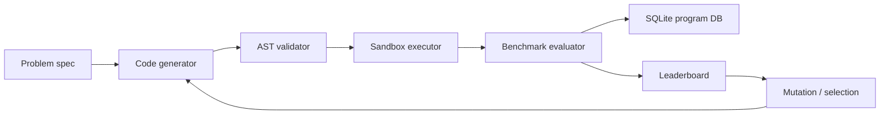

# EvoCode Scientist

[](https://github.com/PRINCE2-AI/evocode-scientist/actions/workflows/ci.yml)
[](https://www.python.org/)
[](https://platform.openai.com/docs)
[](https://fastapi.tiangolo.com/)
[](https://streamlit.io/)
[](LICENSE)
[](https://github.com/PRINCE2-AI/evocode-scientist/stargazers)

**AlphaEvolve-inspired evolutionary coding agent for automated algorithm discovery.**

EvoCode Scientist generates candidate Python programs, executes them in a restricted sandbox, scores them with deterministic benchmark evaluators, stores every attempt in SQLite, and keeps evolving the best candidates across generations.

Research basis: **AlphaEvolve: A coding agent for scientific and algorithmic discovery** ([arXiv:2506.13131](https://arxiv.org/abs/2506.13131)).

> [!NOTE]
> This is an independent portfolio implementation inspired by AlphaEvolve. It is not an official DeepMind implementation and does not reproduce the full production system.

## See It In Action

```text
$ python demo.py

{
  "problem_id": "bin_packing",
  "metrics": {
    "candidate_count": 7.0,
    "best_score": 0.9311,
    "avg_score": 0.9282,
    "passed_count": 7.0
  }
}
```

The default demo runs without paid APIs. If `OPENAI_API_KEY` is set, the same loop can request model-generated candidate mutations and still evaluate them through the same sandbox and benchmark gates.

## Why This Project

Most agent demos stop after a model writes code once. This project closes the loop:

- generate candidate code
- validate syntax and unsafe constructs
- run code in a subprocess sandbox
- score outputs against benchmark tests
- preserve every candidate and parent relation
- select the best candidates
- mutate and evaluate the next generation

That is the engineering pattern behind real autonomous coding systems: generation is only useful when evaluation is strict.

## Architecture



## Features

- OpenAI API mutation generator when `OPENAI_API_KEY` is configured.
- Deterministic local fallback generator for offline demos and CI.
- Restricted subprocess execution with timeout.
- AST checks for unsafe imports and calls.
- Benchmarks for TSP, bin packing, string compression, and knapsack.
- SQLite storage for code, score, generation, parent IDs, prompt, model, and metadata.
- FastAPI endpoints and Streamlit dashboard.
- Offline tests for sandbox, evaluator, evolution, storage, problem registry, and code utilities.

## Quick Start

```bash
python -m venv .venv
```

Windows PowerShell:

```powershell
.\.venv\Scripts\Activate.ps1
pip install -r requirements.txt
Copy-Item .env.example .env
```

macOS/Linux:

```bash
source .venv/bin/activate
pip install -r requirements.txt
cp .env.example .env
```

Run the demo:

```bash
python demo.py
```

Run the API:

```bash
uvicorn app.api:api --reload
```

Run the dashboard:

```bash
streamlit run app/ui.py
```

Run tests:

```bash
pytest -q
```

No-dependency smoke test:

```bash
python tests/run_tests.py
```

> [!IMPORTANT]
> EvoCode Scientist uses the OpenAI API only when `OPENAI_API_KEY` is configured. CI and the local smoke test use deterministic fallback mutations, so the project remains reproducible without paid API calls.

## API

| Endpoint | Purpose |
| --- | --- |
| `GET /health` | Check runtime configuration |
| `GET /problems` | List benchmark problems |
| `GET /problems/{problem_id}` | Inspect one benchmark |
| `POST /run` | Run an evolutionary search |
| `GET /leaderboard/{problem_id}` | Read stored candidate rankings |

Example:

```json
{
  "problem_id": "bin_packing",
  "generations": 2,
  "candidates_per_generation": 3
}
```

## Benchmarks

| Problem | Signal |
| --- | --- |
| `tsp` | Route validity and tour distance |
| `bin_packing` | Capacity validity and number of bins |
| `string_compression` | Correct run-length output and compression quality |
| `knapsack` | Correct optimal value |

## Evaluation Model

Every generated program is evaluated as a candidate, not trusted as an answer. The scoring pipeline records:

- `correctness`: whether benchmark cases pass or optimization output is valid
- `quality`: task-specific score such as fewer bins or shorter routes
- `runtime_ms`: measured subprocess runtime
- `score`: weighted correctness and quality with a runtime penalty
- `lineage`: parent candidate IDs, generation, strategy, prompt, and model

The sample `bin_packing` smoke run currently reaches a deterministic best score around `0.93` on the bundled mini benchmark. Treat this as a small reproducibility check, not a general research benchmark.

## Configuration

Start from [`.env.example`](.env.example):

| Variable | Default | Purpose |
| --- | --- | --- |
| `OPENAI_API_KEY` | empty | Optional key for LLM-generated mutations |
| `OPENAI_MODEL` | `gpt-4.1-mini` | Model used when the API key exists |
| `EVOCODE_DB_PATH` | `data/evocode.db` | SQLite candidate store |
| `EVOCODE_SANDBOX_TIMEOUT` | `2.0` | Candidate subprocess timeout in seconds |
| `EVOCODE_POPULATION_SIZE` | `6` | Elite pool size retained during evolution |
| `EVOCODE_GENERATIONS` | `3` | Default number of search generations |
| `EVOCODE_CANDIDATES_PER_GENERATION` | `4` | Mutations evaluated per generation |

## Project Structure

```text
evocode-scientist/
|-- app/
|   |-- engine.py       # end-to-end evolutionary workflow
|   |-- sandbox.py      # subprocess execution and timeout
|   |-- evaluator.py    # deterministic benchmark scoring
|   |-- evolution.py    # elite selection and local mutations
|   |-- llm.py          # OpenAI adapter and local fallback
|   |-- storage.py      # SQLite candidate store
|   |-- problems.py     # problem registry
|   |-- api.py          # FastAPI API
|   `-- ui.py           # Streamlit dashboard
|-- problems/           # benchmark definitions
|-- tests/              # offline regression tests
|-- docs/
|-- demo.py
`-- README.md
```

## Safety Boundaries

The sandbox is designed for portfolio demos, not untrusted production execution. It blocks common unsafe imports and calls, runs code in a subprocess, and applies timeouts. Production usage would require stronger OS-level isolation such as containers, seccomp/AppArmor, network isolation, memory limits, and audit logging.

> [!WARNING]
> Do not run arbitrary third-party code with this sandbox as-is. It is a learning-oriented execution guard, not a hardened cloud sandbox.

## Repository Topics

Recommended GitHub topics:

```text
alphaevolve, evolutionary-algorithms, code-generation, llm-agents, openai-api,
fastapi, streamlit, sandbox, algorithm-discovery, sqlite
```

## Resume Bullets

- Built EvoCode Scientist, an AlphaEvolve-inspired coding agent that evolves Python solutions through LLM/local mutations, sandboxed execution, deterministic scoring, and population-based selection.
- Implemented AST validation, subprocess timeouts, benchmark evaluators, SQLite candidate lineage storage, and leaderboard metrics across TSP, bin packing, compression, and knapsack tasks.
- Added FastAPI endpoints, a Streamlit dashboard, offline tests, and CI-ready structure for a research-backed autonomous code generation portfolio project.

## Roadmap

- Add Docker-based sandbox isolation.
- Add richer crossover between two parent programs.
- Add OpenAI structured outputs for safer code extraction.
- Add cost and token tracking by generation.
- Add benchmark CSV export and run comparison reports.
